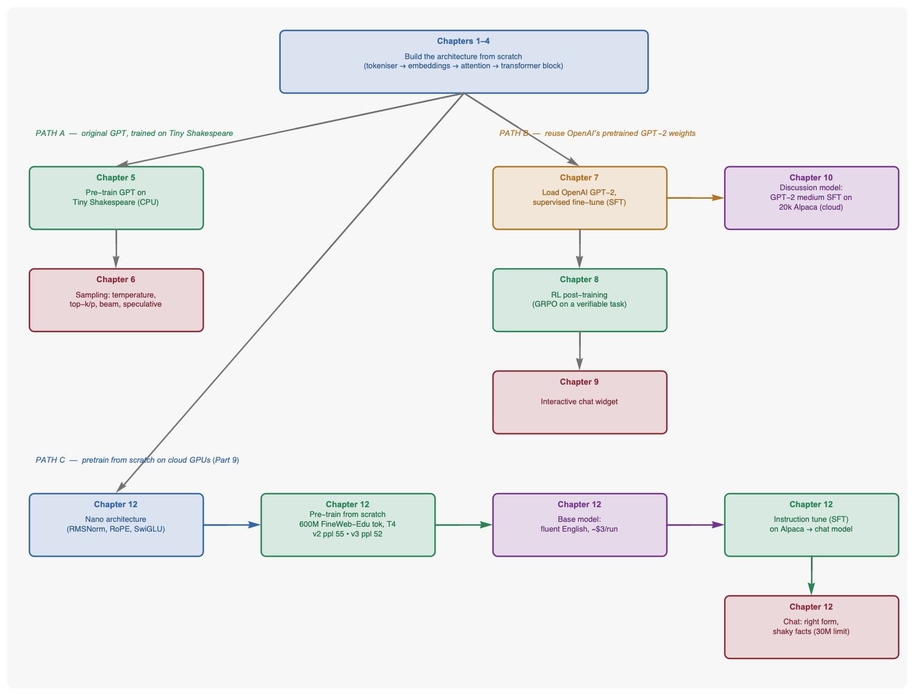
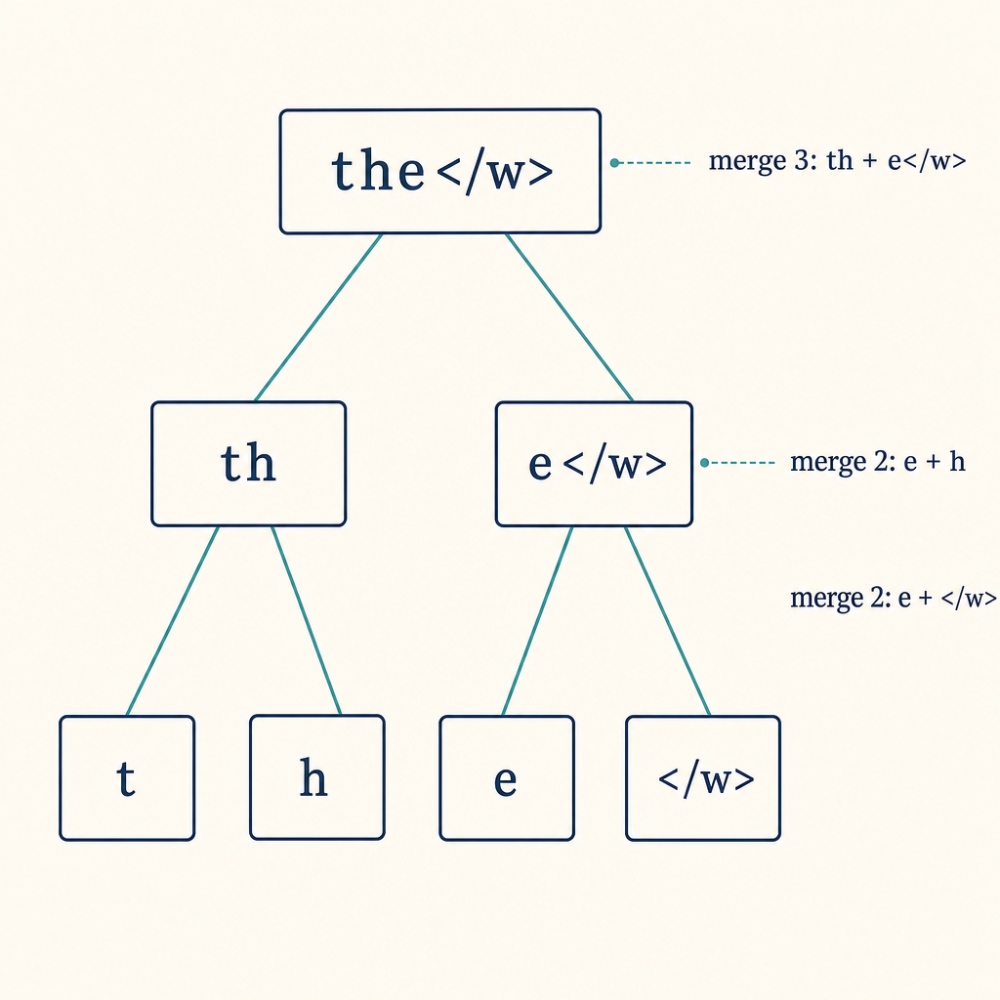
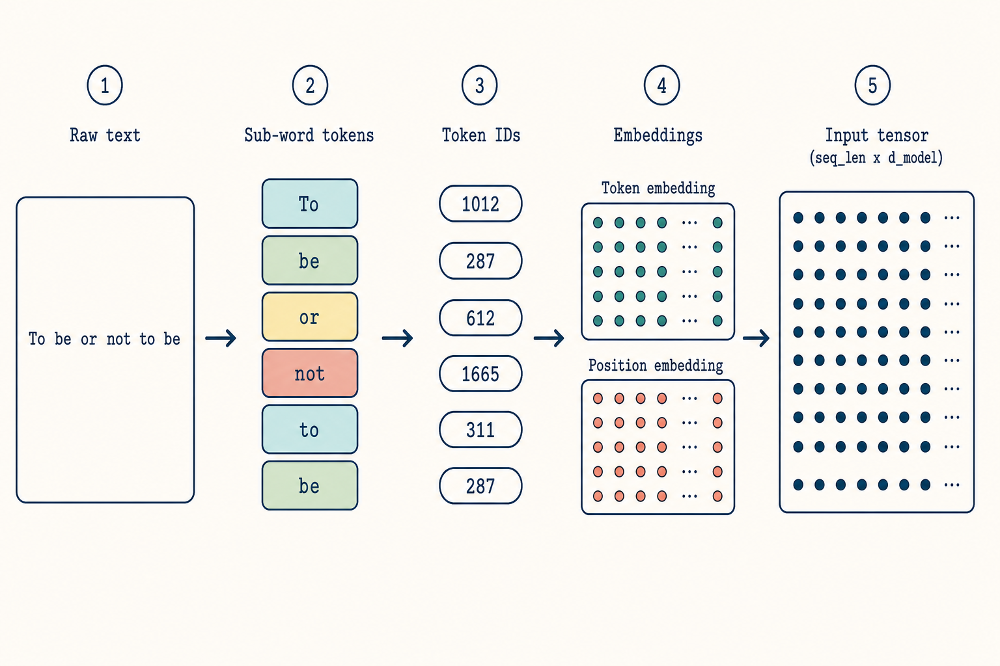
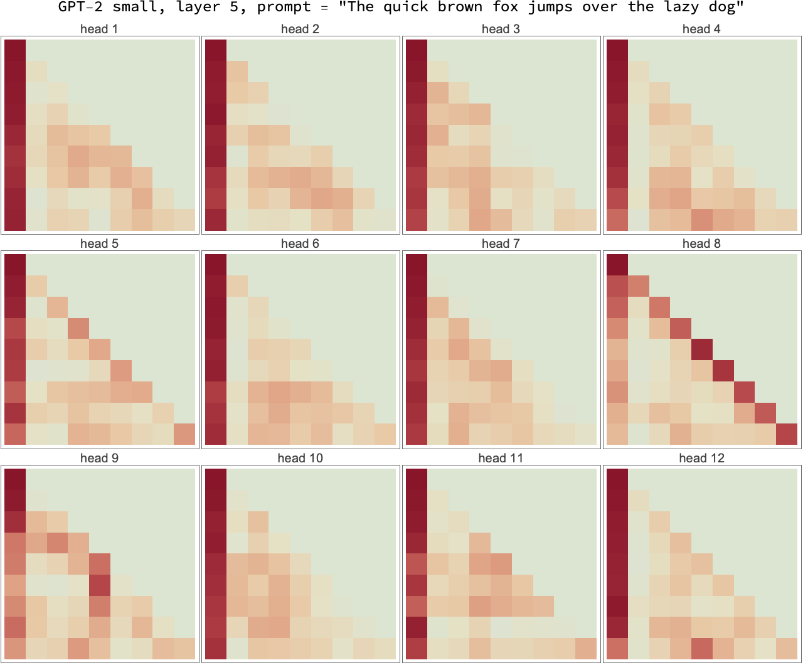
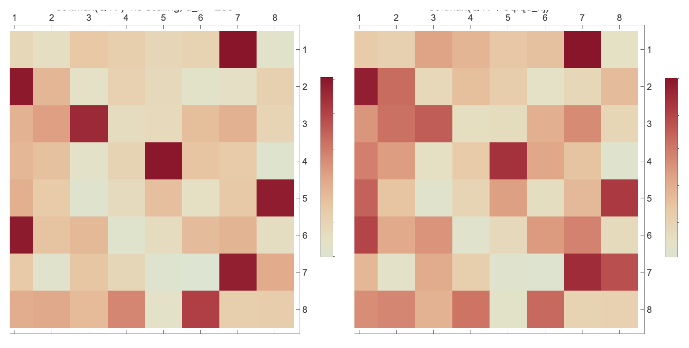
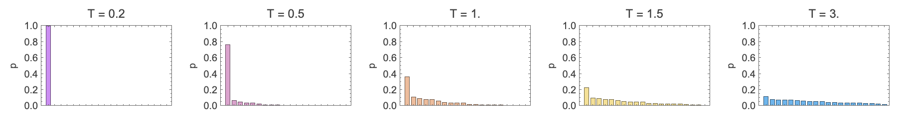
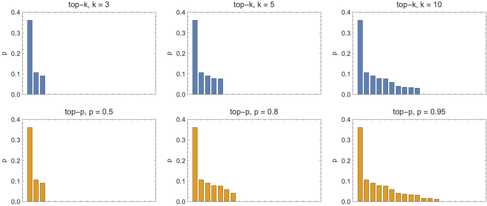

# LLM A to Z — in Wolfram Language

Building a small but **functional** GPT-style language model from scratch,
entirely in the Wolfram Language: from a byte-pair tokeniser all the way to a
model that has been **pretrained from random weights on cloud GPUs**,
instruction-tuned, and made to chat — for about the price of a few coffees.

This is the companion repository to the *LLM A to Z* series on the
[Wolfram Community](https://community.wolfram.com). The whole walkthrough lives
in a single notebook, [`LLM_A_to_Z_evaluated.nb`](LLM_A_to_Z_evaluated.nb)
(with all outputs baked in), which loads the package
[`LLMAtoZ.wl`](LLMAtoZ.wl) from the same directory.

<p align="center">
  
</p>

The notebook follows three paths to a working model, all built on the same
from-scratch foundation (Chapters 1–4):

- **Path A** — train the original GPT architecture on Tiny Shakespeare (Ch 5–6).
- **Path B** — reuse OpenAI's pretrained GPT-2 weights for fine-tuning, RL, and a
  chat widget (Ch 7–10).
- **Path C** — *pretrain a model from scratch on cloud GPUs* (Ch 11), the piece
  nobody had shown end-to-end in WL.

## The chapters

| # | Chapter | Compute |
|---|---------|---------|
| 1 | Tokenisation: turning text into integers (BPE from first principles) | CPU |
| 2 | Attention and the Q/K/V picture | CPU |
| 3 | The transformer block + parameter accounting | CPU |
| 4 | Pre-training: actually training a model | CPU |
| 5 | Sampling: temperature, top-k/p, beam, speculative decoding | CPU |
| 6 | Supervised fine-tuning (instruction-following) | CPU |
| 7 | Reinforcement-learning post-training (GRPO on a verifiable task) | CPU |
| 8 | An interactive chat widget | CPU |
| 9 | An interactive chat widget / deployed model | CPU |
| 10 | Scaling up: GPT-2 medium SFT on 20k Alpaca (the "discussion model") | cloud |
| 11 | **Pretraining a model from scratch** on cloud GPUs | AWS Batch (T4 spot) |
| 12 | Where to go from here | — |

## A few things it shows

**Byte-pair encoding, built and visualised** — watch merges build subword tokens:

<p align="center">
  
  &nbsp;&nbsp;
  
</p>

**Real attention, not just a diagram** — load pretrained GPT-2 and look at what
its heads actually attend to, and why the `1/√d` scaling matters:

<p align="center">
  
  &nbsp;&nbsp;
  
</p>

**Sampling strategies** — temperature, and top-k vs top-p (nucleus):

<p align="center">
  
  &nbsp;&nbsp;
  
</p>

## Chapter 11: a model pretrained from scratch, for ~$3

Chapters 1–8 build and train small models on CPU; the scale-up chapters
fine-tune OpenAI's pretrained GPT-2. Chapter 11 closes the loop — a complete
language model trained **from random initialisation**, on a single rented GPU.

- **Architecture** ([`NanoChat.wl`](part-09-from-scratch/src/NanoChat.wl)) — a
  nano-style transformer in the LLaMA/Mistral/nanochat family: RMSNorm, rotary
  position embeddings (RoPE), SwiGLU MLP, no biases. **~30M trainable
  parameters** (dModel 256, 8 heads, 4 layers, dFF 1024), GPT-2 BPE vocabulary
  (50,257), context length 512.
- **Data** — 600M tokens of FineWeb-Edu (one Chinchilla-optimal epoch, ~20
  tokens per parameter).
- **Compute** — one NVIDIA T4 (AWS Batch spot, g4dn.xlarge): ~16,100 tokens/s,
  ~10.4 hours, **about $2.60 per run**.

The loss starts at `ln(50257) ≈ 10.83` — the cross-entropy of guessing
uniformly among 50,257 tokens — and descends cleanly. Per-shard tail perplexity
for two learning-rate schedules:

| Tokens seen | v2 (per-shard LR) | v3 (global cosine LR) |
|---|---|---|
| 20M  | 160 | 157 |
| 100M | 75  | 76  |
| 300M | 56  | 58  |
| 600M | **55** | **52** |

Perplexity 52 means the model has narrowed 50,257-way confusion down to roughly
52-way — a thousandfold sharper than chance, on a budget that rounds to a
restaurant tip.

**What the base model writes** (verbatim, top-k k=40, temp 0.9):

> **The history of** the American Revolution, and the history of slavery in
> America, was brought to life by the American Revolution. The Civil War was
> based on the battles of the Civil War… the battle of Fort Knox, the Battle…

> **Water is important because** it can be used to make a smooth, clear and clean
> surface… It protects the sealant from injury and reduces the risk of damage.

Grammatical, on-topic English from a network that days earlier was random
numbers — with the repetition and thin world-knowledge a 30M model predicts.

**After instruction tuning** (Alpaca, ~52k examples, ~18 min, ~$0.10) it answers
in the right shape and stops on its own — though, honestly, the facts are shaky:

> **Q: What is the capital of France?**
> A: the capital of France is Britannica, France.

That last example is kept on purpose: a 30M model is fluent but not reliable,
and the chapter is candid about where the ceiling is. Full training curve,
transcripts, costs and engineering notes are in
[`PART9_RESULTS.md`](PART9_RESULTS.md).

The training harness is built for spot interruption: data is sharded with
checkpoints to S3, and a single self-looping cloud job resumes automatically if
its instance is reclaimed.

## Running it

The published artifact is the **two files** that accompany the post:

1. [`LLM_A_to_Z_evaluated.nb`](LLM_A_to_Z_evaluated.nb) — the notebook (open in
   Wolfram Desktop / Player).
2. [`LLMAtoZ.wl`](LLMAtoZ.wl) — the package it loads.

Put both in the **same directory** and open the notebook; its Setup section runs
`SetDirectory[NotebookDirectory[]]` then `Get["LLMAtoZ.wl"]`, so everything
resolves with no extra configuration. The per-chapter `part-*/src/` folders hold
the underlying Wolfram Language sources.

## Chat with the from-scratch model

The instruction-tuned Chapter-11 model is published as a
[**release asset**](../../releases/tag/v1.0-model) (`nano30M_v3_sft.wlnet`,
155 MB — too large for the git tree). It is genuinely trained from scratch:
fluent and on-topic, but small enough that its facts are unreliable (that is the
honest point of Chapter 11). You need the Wolfram Language — Desktop or the free
[Wolfram Engine](https://www.wolfram.com/engine/).

First, download the model into `data/models/`:

```bash
mkdir -p part-09-from-scratch/data/models
curl -L -o part-09-from-scratch/data/models/nano30M_v3_sft.wlnet \
  https://github.com/mthiel74/LLM-A-to-Z-in-Wolfram/releases/download/v1.0-model/nano30M_v3_sft.wlnet
```

**Pure Wolfram, no other dependencies** — `Gpt2Bpe.wl` reimplements GPT-2's
byte-level BPE tokeniser natively (verified token-for-token against `tiktoken`),
so `chat_repl.wls` needs nothing but the Wolfram Language:

```bash
cd part-09-from-scratch
# one question:
wolframscript -f src/chat_repl.wls nano30M_v3_sft.wlnet "What is the capital of France?"
# or an interactive prompt (type questions, blank line to quit):
wolframscript -f src/chat_repl.wls
```

Example output from the model:

> **Q: What is the capital of France?**
> A: France is the second largest country in the world, with the US and Russia
> having the highest GDP.

Fluent, confidently structured, and wrong — exactly what a 30M model trained on
a tutorial budget produces, and exactly the point Chapter 11 is honest about.

A Python variant (`src/chat.wls` + `encode_chat.py`/`sample_decode.py`, using
`tiktoken` for the tokeniser) is also included if you prefer it.

## Repository layout

```
LLM_A_to_Z_evaluated.nb   the notebook (baked-in outputs) — open this
LLM_A_to_Z.nb             the same notebook without evaluated outputs
LLMAtoZ.wl                the package the notebook loads
PART9_RESULTS.md          full from-scratch-pretraining results & notes
part-01-…/ … part-09-…/   per-chapter src/, figures/, notebook/, README
discussion-model/         the GPT-2-medium scale-up ("discussion model")
```

## Credits and scope

A *companion-in-spirit* to Sebastian Raschka's *Build a Large Language Model
from Scratch* (Manning, 2024) and to Karpathy's `nanochat` (2024–25). The code,
derivations, and exposition are original; the shared ground is the canonical
transformer maths and the Tiny-Shakespeare convention. Cloud examples use AWS
identifiers replaced with placeholders (`EXAMPLE-BUCKET`, `ACCOUNT_ID`, …) —
substitute your own to reproduce.

## License

MIT for the code. Tiny Shakespeare is public domain.
