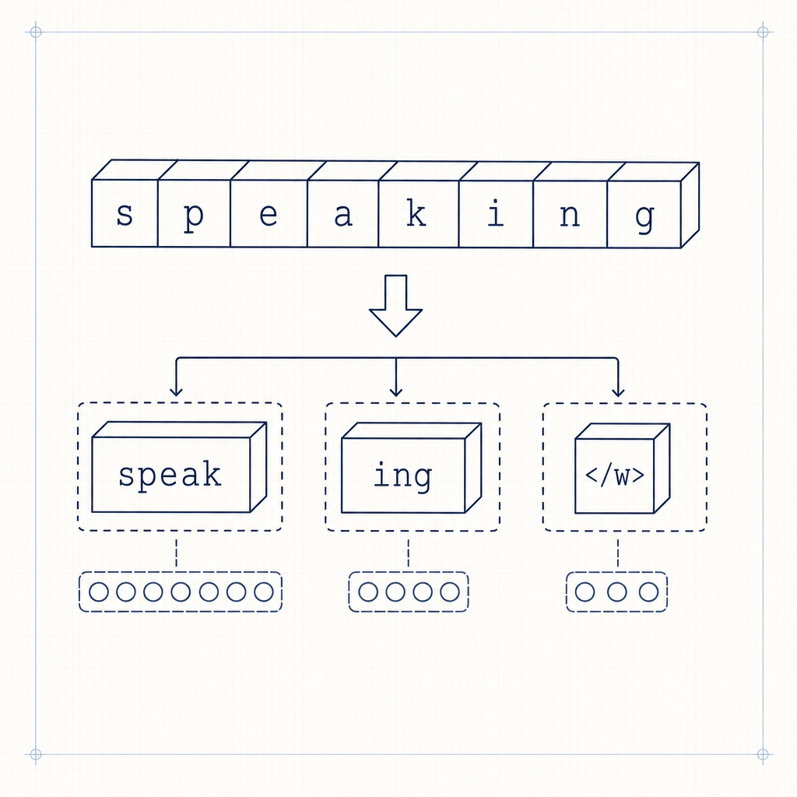
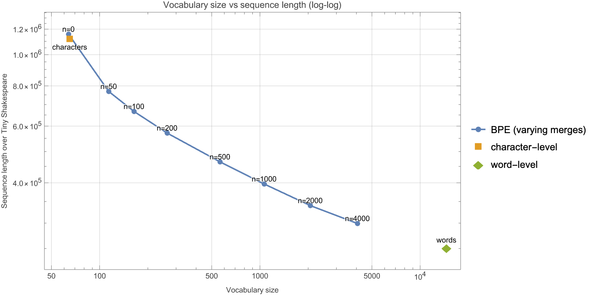
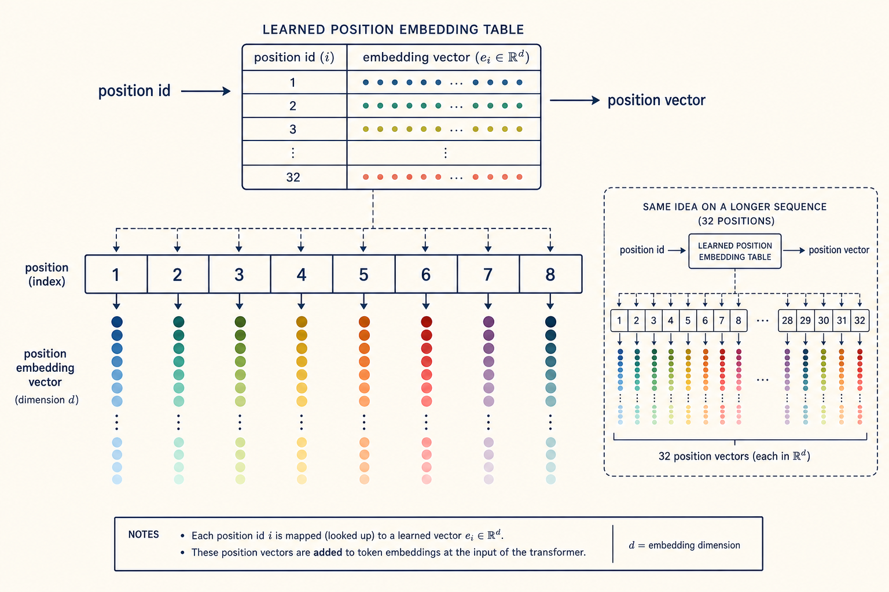
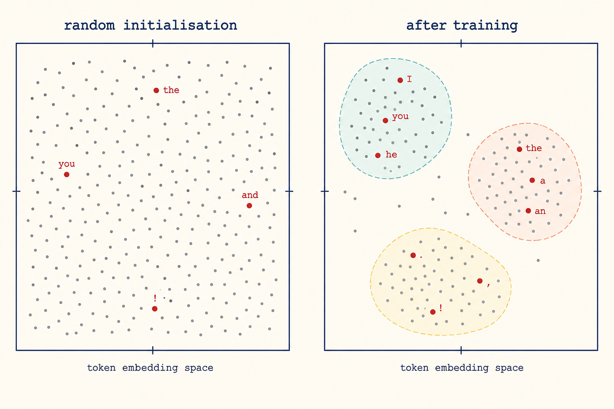
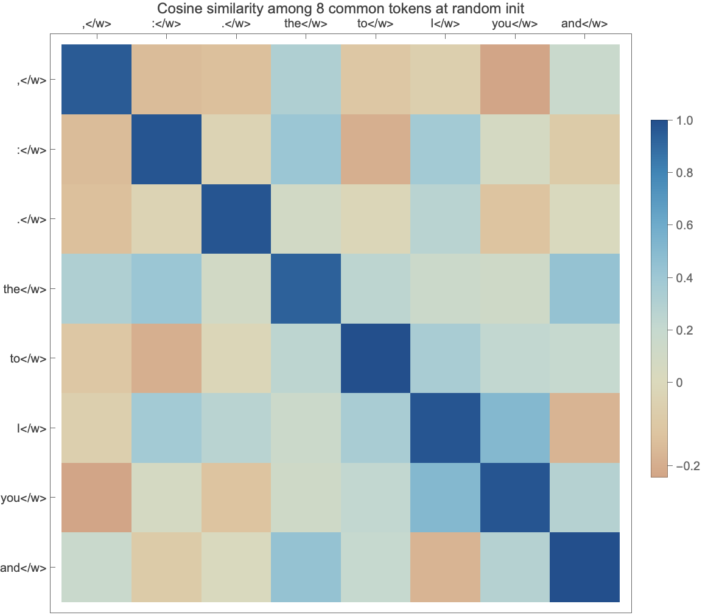
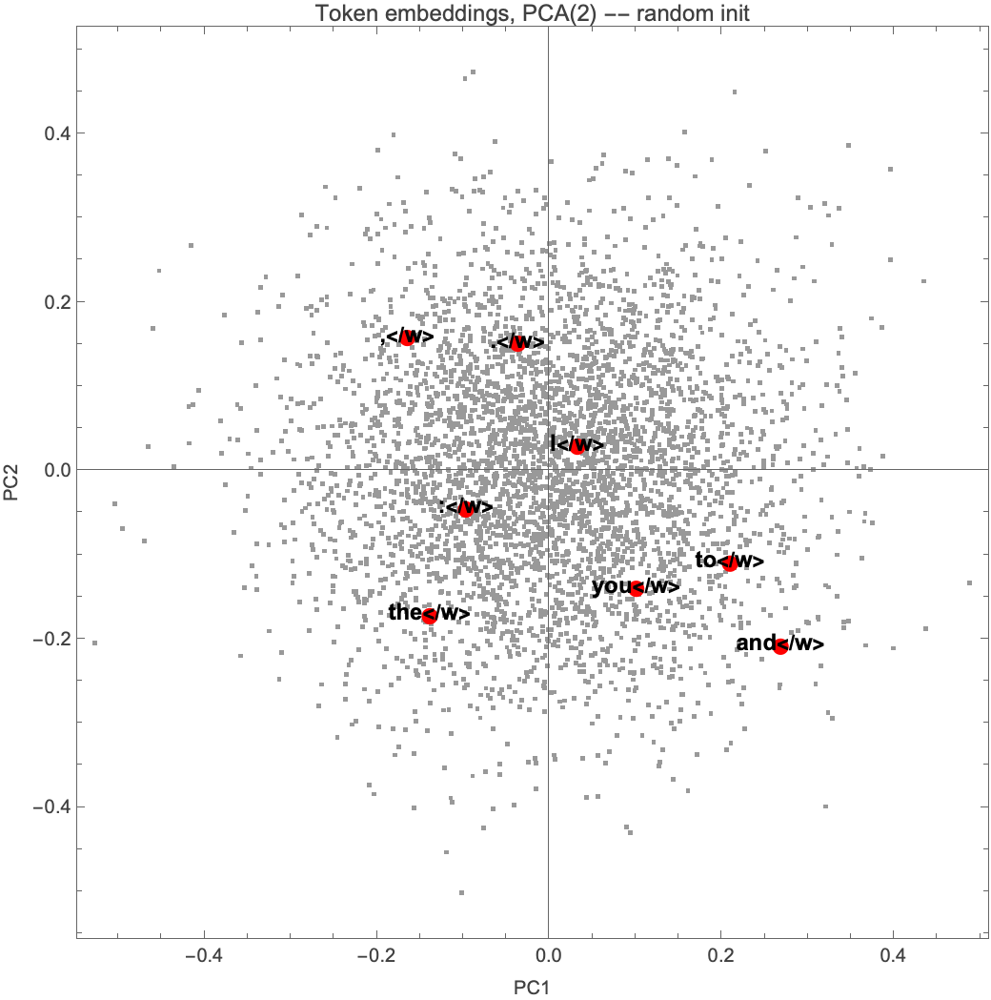

# Build a Large Language Model from Scratch — in Wolfram Language
## Part 1: Tokeniser and embeddings

*This is the opening post of a eight-part series that builds a small
transformer language model entirely in Wolfram Language. Each part is
self-contained and runs on a Mac mini with no GPU. The series is a
companion-in-spirit to Sebastian Raschka's* Build a Large Language Model
from Scratch *(Manning, 2024), but every line of code, every derivation,
and the whole exposition is original. The intersection with the book is
the canonical mathematics of the transformer, which has been the same
since 2017, and the use of Tiny Shakespeare as the corpus, which has
been a community convention since Karpathy's `char-rnn` (2015).*


A language model is, in the end, a function `ℝ^{n × d} → ℝ^{n × |V|}`:
a sequence of `n` continuous vectors of size `d` goes in, and out comes a
sequence of probability distributions over a vocabulary of size `|V|`.
Everything that the architecture papers and the GPT pre-prints argue
about — attention, normalisation, residuals — sits inside that function.
But there are two pieces *outside* of it that decide what the function is
allowed to see, and they are the subject of this first post.

**The first piece** is the tokeniser. It decides what "an input" actually
is: characters, whole words, sub-word pieces? The choice fixes the
vocabulary size `|V|` and, for a given chunk of text, the sequence length
`n`. These two numbers trade off against each other in a way that is the
whole story of byte-pair encoding.

**The second piece** is the embedding layer. It maps the *discrete* token
IDs the tokeniser produces into the *continuous* vectors the transformer
operates on. There are two of them, summed together: one indexed by token
ID (what the token is), and one indexed by position (where in the sequence
it sits). At this point — before any training has happened — both of
these are random matrices. The whole job of training a language model
is, in part, to turn those random matrices into ones with structure.

By the end of this post we will have a `bpeTokenise` function and a
`NetGraph` embedder, both reusable by Parts 2 through 5, and we will have
looked at the geometry of token space *before any training* so that we
have a baseline for the "after" picture in Part 4.

---

## 1. Three ways to slice a sentence

Before BPE, the two trivial baselines. Character-level: the vocabulary is
just the set of characters that appear in the corpus, and the sequence
length is the length of the corpus in characters. Word-level: the
vocabulary is the set of distinct whitespace-separated words, and the
sequence length is the number of word occurrences.

```wolfram
charBaselineVocabulary[text_String] := Union[Characters[text]];

preTokenise[text_String] := Select[
  StringSplit[text,
    RegularExpression["(\\s+|(?<=[^A-Za-z'])(?=[A-Za-z'])|(?<=[A-Za-z'])(?=[^A-Za-z']))"]],
  StringMatchQ[#, RegularExpression["\\S+"]] &
];

wordBaselineVocabulary[text_String] := Union[preTokenise[text]];
```

The regex in `preTokenise` splits on whitespace *and* between alphabetic
and non-alphabetic characters, so `"Hello, world!"` becomes
`{"Hello", ",", "world", "!"}` rather than `{"Hello,", "world!"}`. Punctuation
gets its own pre-tokens — this matters because BPE will then treat each
pre-token as an atomic unit and never merge across them.

On Tiny Shakespeare (~1.1 MB):

| Strategy        | Vocab size | Sequence length |
|-----------------|-----------:|----------------:|
| Character-level |         65 |     1,115,393 |
| Word-level      |     14,571 |       251,610 |

Both extremes hurt the model: characters drown it in a sequence so long
that long-range attention is useless; words give it a fresh symbol for
every rare conjugation and proper noun, so the model never sees most of
them more than once or twice during training, which is statistically the
opposite of helpful.

## 2. Byte-pair encoding, from first principles

BPE was originally a compression algorithm (Gage, 1994). The idea
transplanted to text tokenisation (Sennrich, Haddow, Birch, 2016) is:

1. Start with the alphabet — the set of characters in the corpus.
2. Count every adjacent pair of symbols across the (pre-tokenised) corpus.
3. Take the most frequent pair and treat it as a new symbol from now on.
4. Repeat until you have done some target number of merges, *or* until
   no pair occurs more than once.

The vocabulary you end up with contains common short pieces — *th*, *the*,
*ing*, *ed*, *Mr*, *ou*, *<space>* — alongside the original characters.
A pre-token like `"speaking"` typically tokenises to `{"speak", "ing</w>"}`:
the end-of-word marker `"</w>"` always merges left into the final piece,
because it is just another symbol from the algorithm's point of view. A
rare proper noun like `"Coriolanus"` would still be representable in the
worst case as `{"C", "or", "io", "lan", "us</w>"}` — never as `<UNK>`.
That property — *no out-of-vocabulary token, ever* — is the deep reason
BPE has stuck.



The merge order in BPE produces a tree: each high-rank merge token (like
`the</w>`) descends to two earlier-rank tokens, which themselves descend
to characters at the leaves. The picture for `the</w>` is just three
merges deep:


### 2.1 The merge loop in WL

We represent each pre-token's frequency once and never duplicate work.

```wolfram
wordSymbolList[word_String] := Append[Characters[word], "</w>"];

(* `state` is a list of {symbolList, frequency} pairs. *)
pairCounts[state_List] := Merge[
  Flatten[
    Map[
      Function[entry,
        With[{syms = First[entry], freq = Last[entry]},
          (# -> freq & /@ Partition[syms, 2, 1])
        ]
      ],
      state
    ],
    1
  ],
  Total
];

mergeOnce[state_List, pair : {a_String, b_String}] :=
  With[{joined = a <> b},
    Map[
      Function[entry,
        {SequenceReplace[First[entry], {a, b} -> joined], Last[entry]}
      ],
      state
    ]
  ];

trainBPE[text_String, numMerges_Integer] := Module[
  {wordFreqs, state, mergeRules = {}, counts, best},
  wordFreqs = Counts[preTokenise[text]];
  state = KeyValueMap[{wordSymbolList[#1], #2} &, wordFreqs];
  Do[
    counts = pairCounts[state];
    If[Length[counts] == 0, Break[]];
    best = First @ Keys @ ReverseSort[counts];
    AppendTo[mergeRules, best];
    state = mergeOnce[state, best],
    {numMerges}
  ];
  <|"MergeRules" -> mergeRules,
    "BaseAlphabet" -> Union[Flatten[Characters /@ Keys[wordFreqs]]]|>
];
```

Three WL idioms worth pausing on, because they replace what would be
several pages of bookkeeping code in Python:

- **`Counts[preTokenise[text]]`** gives the pre-token frequency map as a
  one-liner. There is no `defaultdict(int)` loop.
- **`Merge[ ..., Total]`** is the right hammer for "I have many `key →
  value` pairs with duplicate keys; sum the values". The keys can be
  *arbitrary* WL expressions, including 2-element lists like `{"t", "h"}`,
  so the pair-frequency map needs no encoding tricks.
- **`SequenceReplace[syms, {a, b} -> a <> b]`** does the in-place pair
  merge inside a symbol list. No two-pointer loop, no off-by-one.

### 2.2 Encoding new text

Once the merge rules are learned, tokenising new text is just applying
them in order to each pre-token:

```wolfram
applyMerges[word_String, mergeRules_List] := Module[{syms},
  syms = wordSymbolList[word];
  Do[
    syms = SequenceReplace[syms,
      {rule[[1]], rule[[2]]} -> rule[[1]] <> rule[[2]]],
    {rule, mergeRules}
  ];
  syms
];

bpeEncode[text_String, mergeRules_List] :=
  Flatten[applyMerges[#, mergeRules] & /@ preTokenise[text]];
```

A worked example: with 1000 merges learned on Tiny Shakespeare,

```wolfram
bpeEncode["To be or not to be, that is the question.", mergeRules]
```

returns

```
{"To</w>", "be</w>", "or</w>", "not</w>", "to</w>", "be</w>", ",</w>",
 "that</w>", "is</w>", "the</w>", "qu", "es", "tion</w>", ".</w>"}
```

Common short words (`"To"`, `"be"`, `"or"`, `"the"`) compress to a single
token. The less-common `"question"` decomposes into three pieces. Training
1000 merges on the full corpus takes about 7 seconds on a Mac mini; 4000
merges, used to draw the curve below, takes ~12 seconds.

On the production side, the inner loop here would maintain its
pair-count table incrementally (only the merge's affected pre-tokens
update on each step), which is roughly what `tiktoken` does. The
implementation in this post does exactly that; for clarity, the snippet
above shows the per-iteration logic the maintained version is
equivalent to.

## 3. The vocab–sequence trade-off, as a curve

Train BPE with progressively more merges and watch what happens. At
zero merges the BPE-tokenised corpus is one symbol per pre-token
character plus a single `</w>` marker per pre-token — *not* the raw
character count of the corpus, because `preTokenise` drops whitespace
before BPE ever sees it. The arithmetic is `chars_in_pretokens +
n_pretokens = 905,502 + 251,610 = 1,157,112` tokens at 0 merges, with a
vocabulary of 64 (the alphabet that actually appears inside
pre-tokens). As merges accumulate, the vocabulary grows by one per
merge and the sequence length *shrinks* — every merge eats some number
of adjacent symbol pairs across the corpus, and the sequence loses
that many positions.



The numerical picture: at 50 merges the sequence is already at 769 k
tokens — a third shorter than the character baseline for the price of
50 extra vocabulary entries. At 500 merges the sequence is at 465 k
(below half); at 4000 merges, 299 k, still six times shorter than
character-level. The curve flattens because later merges chase
increasingly rare bigrams. The two extreme baselines sit at the
corners: character-level is the cheap-vocabulary, expensive-sequence
corner; word-level (14,571 vocab, 252 k tokens) is the
cheap-sequence, expensive-vocabulary corner. A practical model picks an
interior point — typically several thousand to several tens of
thousands of BPE merges. The post-training model in Part 4 uses 1000
merges and a vocabulary of about 1,064.

## 4. From tokens to tensors: the embedding layer

A transformer doesn't see token IDs; it sees vectors. So once we have a
list of integer token IDs, we feed them through two embedding tables in
parallel:

- **Token embedding** `E_tok ∈ ℝ^{|V| × d}`: row `i` is the vector for
  token-ID `i`. Learnable.
- **Positional embedding** `E_pos ∈ ℝ^{n_max × d}`: row `j` is the vector
  for the `j`-th position in the sequence. Also learnable.

The model input is the elementwise sum `E_tok[ids] + E_pos[positions]`.
That sum is what flows into the transformer blocks. Why a *sum* rather
than a concatenation? Because the dimensions are kept aligned, the
transformer needs no extra parameters to combine them; and a sum is what
falls out naturally when you ask "what is the right basis-free way to
combine two pieces of information that live in the same vector space"
— either is just a vector, and their sum is a vector.



In WL this is a three-node `NetGraph`:

```wolfram
tokenPositionEmbedder[vocabSize_, dModel_, maxSeqLen_] := NetInitialize @
  NetGraph[
    <|
      "tokenEmbed"    -> EmbeddingLayer[dModel, vocabSize],
      "positionEmbed" -> EmbeddingLayer[dModel, maxSeqLen],
      "sum"           -> ThreadingLayer[Plus]
    |>,
    {
      NetPort["tokens"]    -> "tokenEmbed",
      NetPort["positions"] -> "positionEmbed",
      {"tokenEmbed", "positionEmbed"} -> "sum"
    }
  ];
```

`NetInitialize` populates the two embedding matrices with small random
values; until we train (Part 4), those are what the model sees. Calling
`embedder[<|"tokens" -> ids, "positions" -> Range[Length[ids]]|>]` on a
length-`n` sequence of IDs returns the `n × d` input tensor. That tensor
is what Part 2 will take as input to the attention block.

## 5. Geometry before training

We have built a `NetGraph` whose token-embedding row for `"the"` is just
a vector of 64 Gaussian noise samples. Whatever similarity structure the
trained model will eventually have — *King* near *Queen*, *thee* near
*thou*, punctuation off in its own corner — is *not in there yet*. It is
useful to see this with our own eyes so that we have a "before" picture
to compare against in Part 4.



The figure above is the conceptual prediction. The next two are the
empirical version of it on the actual embedder we just built.



The off-diagonal entries are uniform noise centred near zero. The exact
standard deviation of the cosine similarity between two independent
random unit vectors in `d` dimensions is `1/√d`, which for `d = 64`
gives `0.125`. Visually that is exactly what we see: no two tokens are
systematically closer than any other pair.



It is, by construction, a Gaussian blob. The chosen high-frequency tokens
land all over it.

This is the picture we will revisit in Part 4 after training: the same
plot then shows clear clusters, with grammatical and semantic structure
visible to the eye. Until then, the model knows nothing.

---

## What we have, and what comes next

We finish Part 1 with:

- a tokeniser that turns Tiny Shakespeare into a sequence of ~397,000
  BPE token IDs over a vocabulary of about 1,064 at 1000 merges (or
  whatever interior point on the trade-off curve you pick),
- a `NetGraph` embedder that turns that sequence of IDs into a tensor of
  shape `(seqLen, dModel)`,
- a baseline picture of token-space geometry under random initialisation,
- and a curve that justifies the BPE choice empirically rather than
  by appeal to authority.

In **Part 2** we will feed that tensor into the heart of the transformer:
scaled dot-product attention, derived from first principles — including
the `1/√d_k` factor that is not arbitrary, but the unique scaling that
keeps the pre-softmax logits at unit variance. We will then visualise
attention heatmaps on real text using a pretrained GPT-2 small (accessible
in WL via `NetModel["GPT-2 Transformer Trained on WebText Data"]`) so
that the reader sees real, *learned* attention structure before training
their own from scratch in Part 4.

## Reproducing this post

All code lives at
`github.com/mthiel74/LLM-A-to-Z-in-WL/tree/main/part-01-tokeniser-and-embeddings`.
The single command

```bash
wolframscript -file src/run_part01.wls
```

downloads Tiny Shakespeare, trains BPE, sweeps merge counts to draw the
trade-off curve, builds the embedder, and writes every figure that
appears in this post. The whole pipeline runs in a few minutes on a Mac
mini.

*If you found this useful, the next four posts in the series build out
attention (Part 2), the transformer block (Part 3), training on Tiny
Shakespeare (Part 4), and sampling strategies plus an interactive widget
(Part 5).*

## References

- Gage, P. (1994). *A New Algorithm for Data Compression*. The C Users
  Journal, 12(2).
- Sennrich, R., Haddow, B., Birch, A. (2016). *Neural Machine Translation
  of Rare Words with Subword Units*. ACL.
- Vaswani, A. et al. (2017). *Attention Is All You Need*. NeurIPS.
- Raschka, S. (2024). *Build a Large Language Model from Scratch*. Manning.
- Karpathy, A. (2015). `char-rnn`,
  github.com/karpathy/char-rnn. Tiny Shakespeare is the
  `data/tinyshakespeare/input.txt` file in that repository.
