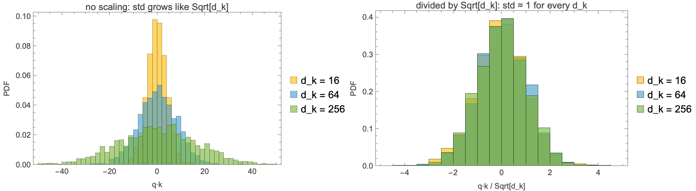
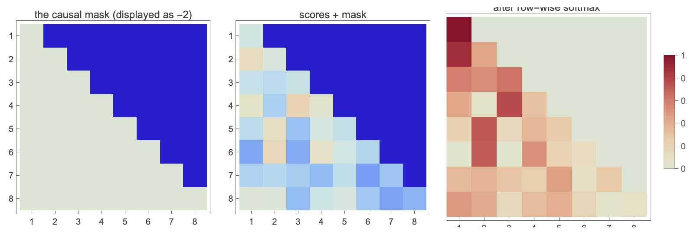

# Build a Large Language Model from Scratch — in Wolfram Language
## Part 2: Self-attention and the QKV picture

*This is the second post in an eight-part series that builds a small,
fully working chat-style language model entirely in Wolfram Language.*
[Part 1](../part-01-tokeniser-and-embeddings/POST.md)
*built a from-scratch BPE tokeniser and a `NetGraph` embedder that
turns a sequence of token IDs into a `(seqLen, d_model)` input tensor.
In this post we feed that tensor into the mechanism the architecture
is actually named for: scaled dot-product attention.*


Two pieces of work for this post: first, derive the `1/√d_k` scaling
factor from the variance of a dot product (the part of the
canonical formula that most expositions assert but do not justify);
second, build single-head and multi-head causal attention as
inspectable `NetGraph`s, then load a pretrained GPT-2 small and look
at its actual attention patterns — *before* we train our own from
scratch in Part 4.

---

## 1. Attention is a learnable weighted sum

Strip everything fancy away. Attention is the operation "each output
token is a weighted sum of the input tokens, where the weights are
learned from the input itself." Suppose we have a 4-token sequence
`x_1, x_2, x_3, x_4`, each in `ℝ^d`. For token 3, a weighted sum is
just

```
y_3 = a_31 x_1 + a_32 x_2 + a_33 x_3
```

with the `a_{3j}` summing to 1. Causal masking forbids attending to
`x_4`. All attention does is decide those weights from the content of
the tokens themselves rather than hand-coding them.

The three-line learnable version: turn each `x_i` into a *query* `q_i`,
a *key* `k_i`, and a *value* `v_i` via three learned linear maps. The
compatibility of token `i` with token `j` is the dot product
`s_{ij} = q_i · k_j`. A softmax across `j` gives the attention
weights; the weighted sum of the values gives the output of token `i`.

An intuition that differs from the usual exposition: the *query* is
the question a token asks of the others; the *key* is the answer it
provides to such queries; the *value* is what it actually passes along
once selected. They are three separate learned views of the same
underlying vector.

## 2. Why divide by √d_k? — derivation, not assertion

Most treatments state the scaled dot-product formula

```
Attention(Q, K, V) = softmax( Q K^T / √d_k ) V
```

and leave the `1/√d_k` factor unexplained. The argument is short and
is one of the places where a small piece of probability theory makes
a design choice obvious.

Suppose `q, k ∈ ℝ^{d_k}` with each component independently drawn from
a zero-mean unit-variance distribution. The dot product

```
q · k = Σ_{i=1}^{d_k} q_i k_i
```

is a sum of `d_k` random terms `q_i k_i`. Each term has mean
`E[q_i k_i] = E[q_i] · E[k_i] = 0` and variance

```
Var(q_i k_i) = E[(q_i k_i)²] − (E[q_i k_i])²
             = E[q_i²] · E[k_i²] − 0
             = 1 · 1 = 1
```

using independence of `q_i` and `k_i` and unit variance of each. The
`d_k` terms are themselves independent across `i`, so the variance of
their sum is the sum of their variances: `Var(q · k) = d_k`. The
standard deviation therefore grows as `√d_k`.

Verify this in two lines of Wolfram Language. Sample 2000 Gaussian
`(q, k)` pairs at three values of `d_k` and look at the empirical
distribution of their dot product:

```wolfram
SeedRandom[1];
nSamples = 2000;
dks = {16, 64, 256};
dots = Association @ Table[
  d -> Table[
    With[{q = RandomReal[NormalDistribution[], d],
          k = RandomReal[NormalDistribution[], d]},
      q . k],
    {nSamples}],
  {d, dks}];
StandardDeviation /@ dots
```

The empirical standard deviations come out to roughly 4, 8, 16 —
matching the predicted `√d_k` of 4, 8, 16 to within statistical
error.

Now look at what this does to a softmax. Softmax of a vector whose
entries have very large spread is degenerate: the largest entry
dominates exponentially and all others are crushed to zero, so the
gradient through the softmax is essentially zero. That is the
gradient pathology that prevents a transformer from learning at any
but the smallest scale.



Dividing by `√d_k` returns the pre-softmax logits to unit variance,
which keeps the softmax in its high-gradient regime. The right-hand
panel above shows the three distributions collapsing onto each other
once we apply the scaling. A concrete softmax demo on synthetic
8-token scores at `d_k = 256`:


## 3. Causal masking

A language model is only allowed to attend to past tokens, never to
future ones. Implementation: add a strict-upper-triangular matrix of
`-∞` to the pre-softmax score matrix; after row-wise softmax those
entries become exactly zero. In Wolfram Language, with a large
negative number standing in for `-∞` (the latter participates in
NaN-producing arithmetic upstream):

```wolfram
causalMask[6] // MatrixForm
```



The triangular indexing here uses WL's 1-based convention.
`UpperTriangularize` with second argument `1` means "above the main
diagonal" — so the diagonal itself stays zero (a token may attend to
itself).

## 4. Single-head causal self-attention as a NetGraph

Six nodes: three `LinearLayer` projections for Q, K, V; a
`FunctionLayer` that computes `Q·Kᵀ / √d_head` and adds the causal
mask; a `SoftmaxLayer` for the row-wise normalisation; and a final
`FunctionLayer` for the value gather. The whole graph is six lines.

```wolfram
singleHeadCausalAttention[dModel_, dHead_, maxSeqLen_] := With[
  {mask = causalMask[maxSeqLen], scale = Sqrt[N[dHead]]},
  NetInitialize @ NetGraph[
    <|
      "q" -> NetMapOperator[LinearLayer[dHead, "Biases" -> None]],
      "k" -> NetMapOperator[LinearLayer[dHead, "Biases" -> None]],
      "v" -> NetMapOperator[LinearLayer[dHead, "Biases" -> None]],
      "scores"  -> FunctionLayer[
         (#Q . Transpose[#K] / scale + mask) &, ...],
      "weights" -> SoftmaxLayer[],
      "output"  -> FunctionLayer[(#W . #V) &, ...]
    |>,
    {NetPort["Input"] -> "q",
     NetPort["Input"] -> "k",
     NetPort["Input"] -> "v",
     "q" -> NetPort["scores", "Q"],
     "k" -> NetPort["scores", "K"],
     "scores" -> "weights",
     "weights" -> NetPort["output", "W"],
     "v" -> NetPort["output", "V"]},
    "Input" -> {maxSeqLen, dModel}]
  ];
```

`NetMapOperator` is the WL idiom for "apply this layer to every
position in the sequence". The score and output `FunctionLayer`s are
transparent: anyone reading the source sees the actual matrix
multiplication. The full `NetGraph` is a small picture in the
notebook, immediately legible.

## 5. Multi-head attention

A single head can only attend in one way at a time. Multi-head
attention runs `n_heads` parallel single-head computations: each head
applies its own learned projections of the full input down to
dimension `d_head`, computes attention independently, and produces
its own `d_head`-dimensional output. The heads are then concatenated
and a final output projection mixes them back into a `d_model`
vector. The
architectural trick is to split `d_model` into `n_heads` equal-size
pieces so the multi-head version has the same parameter count as a
single-head version at `d_model`.

```wolfram
multiHeadAttentionBlock[dModel_, nHeads_, maxSeqLen_] := ...
```

The package implements the parallel-heads form directly for
pedagogical clarity: `n_heads` independent `singleHeadCausalAttention`
subgraphs feeding a `CatenateLayer` and an output `LinearLayer`. A
production version would project Q, K, V once at the full `d_model`
width and then reshape into heads, saving the duplicate projection
overhead; the I/O is identical.

## 6. What real attention looks like: GPT-2 small

We can do something the typical from-scratch tutorial cannot: load a
fully pretrained language model from `NetModel` and look at its actual
attention patterns. GPT-2 small is a 12-layer transformer with 12
heads per layer at `d_model = 768`, `d_head = 64`. Each block's
attention sublayer holds four learned matrices: `W_Q`, `W_K`, `W_V`
(768×768 each) plus a 768×768 output projection.

We have the weights; we can recompute the attention weight matrix for
any input prompt by hand using the same scaled-dot-product formula we
just built. (The `Attention.wl` package wraps this in a single
`gpt2AttentionWeights[gpt, ids, layer]` call that returns the
`(n_heads, seqLen, seqLen)` tensor for the requested layer.)

```wolfram
gpt = NetModel["GPT-2 Transformer Trained on WebText Data",
               "Task" -> "LanguageModeling"];
ids = gpt2EncodePrompt[gpt, "The quick brown fox jumps over the lazy dog"];
weights5 = gpt2AttentionWeights[gpt, ids, 5];
```


Two features jump out. First, every head has a heavily-shaded leftmost
column — a phenomenon called the *attention sink* (Xiao et al.,
2024): attention heads dump probability mass onto the first token as
a "no-op" vote when they have nothing more useful to do. Second, the
heads are not all doing the same thing. Hand-picking three to
illustrate the kinds of specialisation that emerge from training:


- **Left** (previous-token tracker): noticeable mass at row-`i`,
  column-`(i−1)` — a head that summarises immediate context.
- **Middle** (self-attention diagonal): each token re-attends to
  itself, a re-write rather than a look-back.
- **Right** (approximately uniform): mass spreads roughly evenly
  across all accessible past tokens — a smoothed-prefix average.

None of these specialisations is enforced architecturally; they are
what twelve heads turn into when trained against billions of tokens
of text. We will train our own (much smaller) heads in Part 4 and
look at the same kind of figure to see whether 1-megabyte-scale
training is enough to produce recognisable specialisation.

---

## What we have, and what comes next

We finish Part 2 with:

- a first-principles derivation of the `1/√d_k` factor as the unique
  scaling that keeps pre-softmax logits at unit variance,
- a causal-attention `NetGraph` and a multi-head block constructor,
  both reusable in Parts 3–5,
- a method for extracting per-head attention weights from any layer
  of pretrained GPT-2 small, and a gallery showing the heads of one
  layer specialising into recognisable patterns.

In **Part 3** we will wrap this attention block in the canonical
transformer envelope: pre-norm, residual, feed-forward, residual,
stacked `n_layers` times. We will derive the parameter count as a
closed-form function of `(d_model, d_ff, n_heads, n_layers, |V|)`,
build three model sizes (1M, 5M, 25M parameters) for use in Part 4,
and verify the formula against `Information[net,
"ArraysTotalElementCount"]` for each net.

## References

- Vaswani, A. et al. (2017). *Attention Is All You Need*. NeurIPS.
- Radford, A. et al. (2019). *Language Models are Unsupervised Multitask Learners*. (GPT-2 technical report.)
- Xiao, G. et al. (2024). *Efficient Streaming Language Models with Attention Sinks*. ICLR.
- Raschka, S. (2024). *Build a Large Language Model from Scratch*. Manning.
