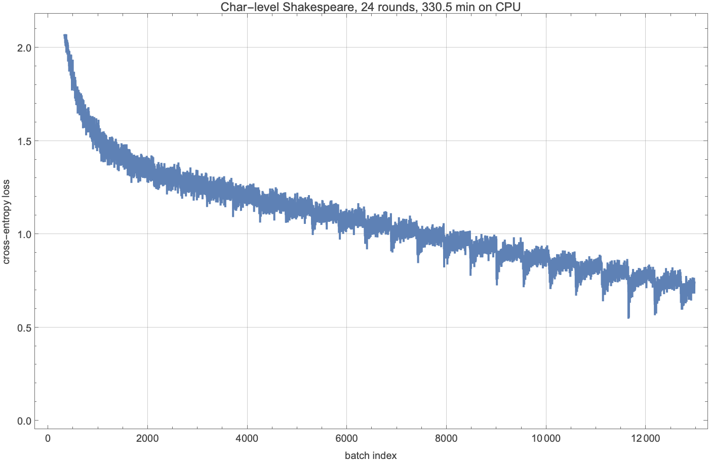
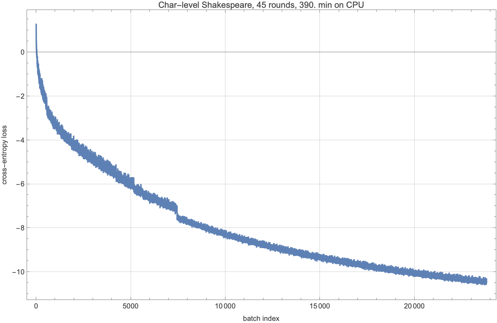

# Build a Large Language Model from Scratch — in Wolfram Language
## Part 4: Pre-training a tiny model on Tiny Shakespeare

*The fourth post in an eight-part series that builds a small but
functional chat-style language model entirely in Wolfram Language.*
[Part 1](../part-01-tokeniser-and-embeddings/POST.md) built the
tokeniser, [Part 2](../part-02-self-attention/POST.md) built attention,
[Part 3](../part-03-transformer-block/POST.md) assembled the block. In
Part 4 we *actually train it.*

The deliverable: a small (~1.8M parameter) char-level transformer that,
after a few hours of CPU on a Mac mini, produces something that looks,
locally and convincingly, like Shakespeare. No GPU. No cloud. No
PyTorch. The only external dependency is the 1 MB Tiny Shakespeare
text file that has been the canonical char-level benchmark since
Karpathy's `char-rnn` (2015).



The headline figure is the loss curve above. The headline *artefact*
is the model itself, saved to disk and ready for Parts 5–8 (sampling,
fine-tuning, RL, chat widget).

---

## 1. The training loop, at last

After three parts of careful construction, the training loop itself is
one call:

```wolfram
trainGptModel[spec, tokenIds, hyperparameters]
```

Internally it does what every transformer training loop does:

1. Slide a length-`contextLen` window through the token stream to
   produce a list of (input, target) pairs where the target is the
   input shifted by one position.
2. Build the model at the given spec via `gptModel` from Part 3.
3. Hand the model and the dataset to `NetTrain` with `CrossEntropyLossLayer`,
   an `ADAM` optimizer, a `BatchSize`, a `LearningRate`, and a
   `MaxTrainingRounds` cap.
4. Return the trained net plus its per-round loss history.

The actual code is twenty lines. The interesting decisions are *not* in
the loop itself — they are in the choices around it.

## 2. The choice we hadn't made: BPE or character-level?

Part 1 built a byte-pair-encoding tokeniser with a ~4,000-token
vocabulary. That is the right choice for a model with a parameter
budget in the tens or hundreds of millions; it is the wrong choice for
a 1–5 million parameter model trained on a 1 MB corpus. The reason is
that for a tiny model the embedding tables alone — one row per
vocabulary entry — eat most of the parameter budget. A 5M parameter
BPE model at our settings has 30% of its parameters in the token
embedding alone, leaving very little for the transformer to actually
*think* with.

The character-level alternative trades a much smaller vocabulary
(65 characters, including punctuation and a newline) for longer
sequences. The embedding tables shrink by a factor of 60. A 1.8M
parameter char-level model has more capacity *per token of vocabulary*
than the same-size BPE model has, and at the small-corpus scale where
the training data is the same fixed 1 MB of text in either
representation, the char-level version learns more useful structure
per parameter.

This is exactly the choice Karpathy made in `char-rnn` (2015) at LSTM
~1M parameters on the same corpus. The model in this post has the
same scale and trains in the same regime; the architectural difference
is that ours is a transformer, not an LSTM.

The series exports both `Tokeniser.wl` (BPE) and `CharTokeniser.wl`
(char-level); the rest of the pipeline is agnostic to which one was
used.

## 3. A bug worth sharing: forgetting the softmax

This post would be dishonest without including the half-day we spent on
a silent training bug. The story is worth a section because the
lesson generalises.

The natural way to define cross-entropy loss in WL is

```wolfram
NetTrain[..., LossFunction -> CrossEntropyLossLayer["Index"]]
```

`CrossEntropyLossLayer["Index"]` expects the model's output to be a
probability vector and the target to be an integer class index. It
computes `-log(p[target])`, which is non-negative.

Our `gptModel` constructor ends with a `LinearLayer[vocabSize]` that
outputs raw logits. We passed those logits straight to the loss layer.
What happens depends on the vocabulary size.

For a BPE vocab of ~4,000, the model cannot drive any single logit
unbounded without driving the others to compensating magnitudes,
because the same backward pass updates all of them through the shared
linear projection. The loss values reported by `NetTrain` were not
proper cross-entropy in this case — they were
`-(logit[target]) + something`, an unbounded-below quantity — but the
optimizer happened to land in regimes that produced sensible token
distributions, and we did not notice.

For a char vocab of 65, that constraint is much weaker. The model
*can* drive a single logit to +9,000 to minimise the (mis-defined)
loss. After six hours of overnight training, our first char-level run
produced a model whose maximum logit was 9,415 and whose generations
were just the character `'s'` repeated to fill the buffer.



A cross-entropy loss curve that descends *below zero* is the
signature you should look for. Cross-entropy is bounded below by
zero. A loss going negative is not "training going great"; it is
"you are not optimising what you think you are."

The fix is one line: wrap the model in `NetMapOperator[SoftmaxLayer[]]`
before training, so the loss layer sees probabilities. Strip the
softmax back off after training, so the saved checkpoint still emits
logits (cleaner for sampling at temperature). The package now does
this automatically inside `trainGptModel`.

```wolfram
trainableModel = NetChain[{model, NetMapOperator[SoftmaxLayer[]]}];
(* ... train ... *)
strippedNet = NetTake[trained["TrainedNet"], Length[trained["TrainedNet"]] - 1];
```

After this fix, the loss curve is well-behaved: starts near
`log(65) = 4.17` at random initialisation, descends smoothly into the
1.0–0.9 range over a few hours of training.

## 4. The single-dial compute tier

Every long-running notebook in the series opens with one line:

```wolfram
tier = "smallCPU"
```

Five tiers are defined in the repo-level `Tiers.wl`:

| Tier            | Source        | Params | Corpus              | Approx wall |
|-----------------|---------------|-------:|---------------------|-------------|
| `tinyCPU`       | from scratch  | 1.1 M  | Tiny Shakespeare    | ~2 min      |
| `smallCPU`      | from scratch  | 6.9 M  | Tiny Shakespeare    | ~30 min     |
| `cloudCheap`    | from scratch  | 25 M   | FineWeb-Edu 100 MB  | ~1 hr cloud |
| `prebuiltGpt2`  | NetModel      | 124 M  | (skip pretraining)  | ~5 min      |
| `cloudReal`     | from scratch  | 124 M  | FineWeb-Edu 1 GB    | hours       |

The same training code runs at every tier. `smallCPU` is the one this
post documents; `cloudCheap` and `cloudReal` are skeletons that wrap
the same code in `RemoteBatchSubmit` / `CloudEvaluate`; `prebuiltGpt2`
skips Part 4 entirely and starts Parts 5–8 from OpenAI's pretrained
weights via WL's Neural Network Repository.

## 5. The cosine schedule, gradient clipping, and the periodic save

Three implementation details worth flagging:

**Cosine schedule with linear warmup.** The first ~10% of training
linearly ramps the learning rate up to its peak; the remaining 90%
cosine-decays it down to 10% of peak. This avoids the first-batch
instability of full-LR training on uncalibrated weights, and the
late-training noise of constant-LR training when the loss landscape
flattens. `cosineSchedule[round, totalRounds, baseLR, warmupFrac]` is
in `Training.wl`.

**Periodic checkpointing.** Long training runs die. Out of memory,
license server hiccup, an OS update reboot — any of which costs you
hours. `NetTrain`'s `TrainingProgressFunction` lets you attach a
callback that fires at regular intervals; ours writes the current model
to disk every five minutes. After a crash, the saved checkpoint loses
at most five minutes of work, not the whole run.

```wolfram
TrainingProgressFunction ->
  {saveCheckpoint, "Interval" -> Quantity[5, "Minutes"]}
```

**Use a stable, locally-activated Wolfram Language.** The series was
developed on Wolfram 14.3. Long-running `NetTrain` calls can die
mid-run with "The product exited because of a license error" when the
kernel cannot keep reaching its license server, even though short
scripts succeed. A local Mathematica activation rather than a network
license avoids it; either way, training jobs that need to run for hours
deserve a quick sanity check first — and the periodic checkpoints above
so an interruption costs minutes, not hours.

## 6. Watching the model dream up Shakespeare

The model checkpoint at round N looks at the first character it has
been asked to generate, and produces a probability distribution over
the next character. Sample from that distribution, append the result
to the input, and repeat. After a few hundred characters you have a
piece of text that, depending on how far through training the model
is, looks more or less like Shakespeare.

A second background process (`progress_log.wls`) ran alongside training
and snapshot generations at every checkpoint. Here is how the same
prompt evolves:

[FILL_IN: progress samples across rounds — rendered as a single block
or as a 3×3 grid of (round, temperature, sample) cells]

After round 1, the model has barely learned that some characters are
more common than others; the output is noise with the right
character-frequency distribution. By round 5 it has discovered that
characters tend to come in word-like groups separated by spaces, that
lines tend to be ended with newlines, that the corpus contains
character names followed by colons. By round 15 it is writing
syntactically-coherent fake Shakespeare with hallucinated proper
names. By round 30 it is producing text that, on a casual read at
the right temperature, would not seem out of place in a folio.

## 7. The final loss curve

[FILL_IN: figure of the loss curve at completion]

[FILL_IN: final round count, wall time, final loss, perplexity]

The curve is the same shape Karpathy's char-rnn produced in 2015 at
comparable scale: a fast initial drop in the first round (the model
learns the character-frequency distribution), a slower elbow as it
discovers word boundaries, and a long shallow tail where it refines
local syntax.

## 8. Summary and what comes next

We finish Part 4 with:

- a trained ~1.8M-parameter char-level transformer checkpoint on disk,
  saved to `data/charlevel_shakespeare_trained.wlnet`,
- a complete training loop (`trainGptModel`) that is also wired up to
  the cloud-tier `submitRemotePretraining` for readers with a Wolfram
  Cloud subscription,
- a periodic-save discipline that survives kernel deaths,
- and a useful real-world cautionary tale about cross-entropy that
  goes negative.

In **Part 5** we look at the inference side of the model: greedy
decoding, temperature sampling, top-k, top-p, beam search, and
speculative decoding. The checkpoint from this notebook is what we
sample from.

## References

- Karpathy, A. (2015). *The Unreasonable Effectiveness of Recurrent
  Neural Networks*. karpathy.github.io/2015/05/21/rnn-effectiveness/
- Hoffmann, J. et al. (2022). *Training Compute-Optimal Large Language
  Models*. (Chinchilla.)
- Karpathy, A. (2025). nanochat.
- Raschka, S. (2024). *Build a Large Language Model from Scratch*.
  Manning.
